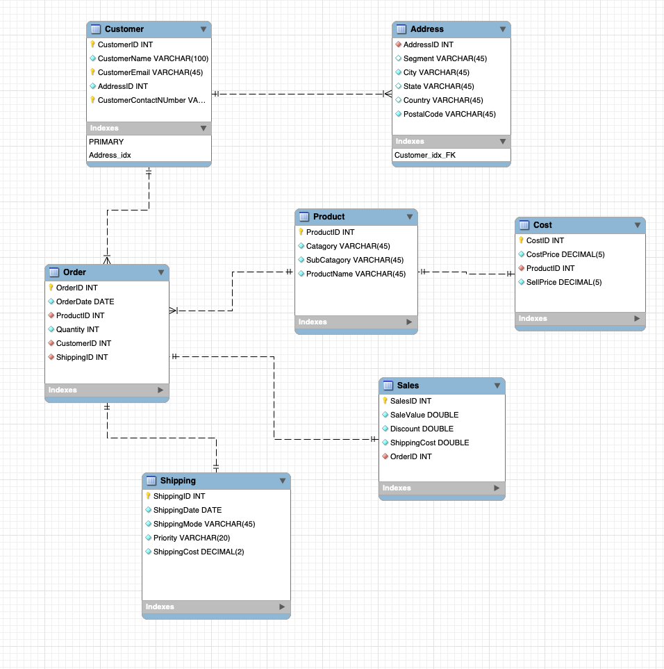

# Global-Super-Store-Database

## About the Project

This project is about designing a database model for Global Super Store to arrange their data in a way more scalable, clean and useful for their business needs and to be able to some data analysis in order to achieve their business goals. this is the project of the 7th course Advanced Data Modeling of Meta Database Engineer Professional Certificate on Coursera.

# About the Data

Global Super Store(GSS) store data about the orders which have been made by customers. There's information is on a wide xlsx sheet and is a very basic way of storing information making it hard to benefit from their stored info. 

All those information is stored in ONLY ONE dataset. This makes the data difficult to monitor, analyze, and extract insights! Therefore we need a structured database to store all those information in a simple and easy-to-monitor format.

# Data Modeling

To make a well designed database, we start by planning it. A ERM (entity relationship model) is what we will use to design this database.

The dataset contains the following entities:

Order
Customer
Product
Sales
Address
Shipping
Cost

There are there levels of modeling, 1- conceptual model which we have been given so i will ommit it. 2 - logical data model and finally a physical data model.

The logical and physical data model:
the physical data model is basically a logical data model with all the gaps filled. All relationships foreign key connections and normalisation standards (up to normal form 3) are applied here

My ERM:

